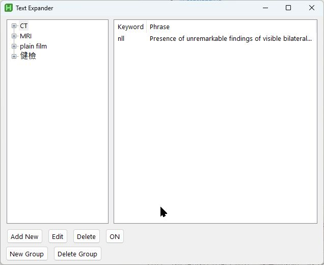

# Text Expander

一個基於 AutoHotkey v2 開發的文字擴展工具，用於快速輸入預設的文字片段。

## 功能特點

- 支持按組管理文字片段
- 提供兩種輸出模式：直接輸入和剪貼板貼上
- 支持中英文輸入法自動切換
- 可以儲存純文字備忘錄（不觸發替換的筆記）
- GUI 介面支持自由縮放
- 使用空格或句點觸發替換
- 可以通過按鈕或快捷鍵（Ctrl+Alt+S）快速開關功能
- 自動保存使用者偏好設定

## 使用方法

1. 管理文字片段：
   - 使用左側樹狀圖管理分組
   - 使用右側列表查看和編輯文字片段
   - 支持新增、編輯、刪除操作

2. 觸發方式：
   - 輸入關鍵字後按空格或句點即可觸發替換
   - 例如：輸入 "key" 後按空格，會自動替換為預設的文字

3. 輸出模式：
   - Send Text：直接模擬鍵盤輸入
   - Ctrl+V：使用剪貼板貼上（推薦，速度更快）

## 系統需求

- 作業系統：Windows
- 執行環境：AutoHotkey v2.0 或更高版本

## 檔案說明

- `text expander.ahk`：主程式檔案
- `snippets.ini`：文字片段儲存檔案
- `textEx_settings.ini`：使用者設定檔案

## 注意事項

- 建議使用 Ctrl+V 模式，效能較佳
- 可隨時使用 Ctrl+Alt+S 或界面按鈕開關功能
- 視窗大小可自由調整，介面會自動適應

