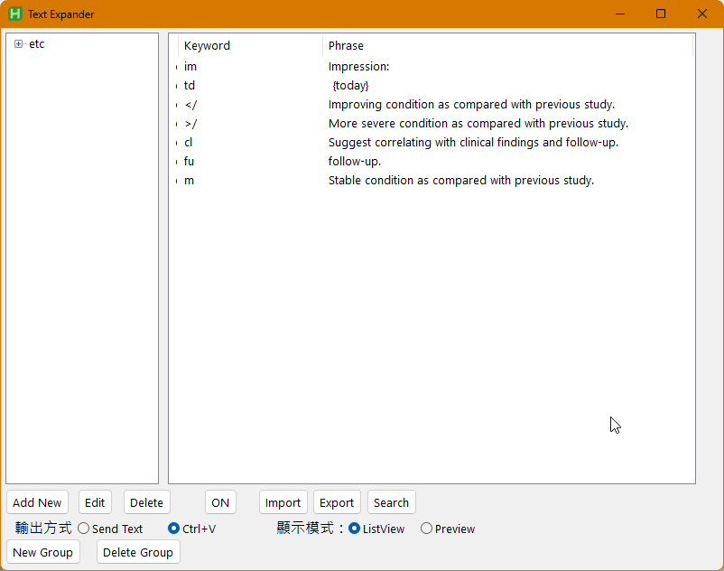

# Text Expander

A text expansion tool developed with AutoHotkey v2, designed for quick input of predefined text snippets.

This project was completed with the assistance of Anthropic's Claude 3.5 Sonnet (2024.04). Claude provided comprehensive programming guidance, code optimization suggestions, and troubleshooting solutions, making significant contributions to the project's development.

## Features

- Group-based text snippet management
- Dual output modes: direct input and clipboard paste
- Automatic input method switching
- Memo function for notes (without triggering replacement)
- Resizable GUI interface
- Space or period trigger options
- Quick toggle via button or hotkey (Ctrl+Alt+S)
- Automatic user preference saving

## Usage

1. Managing Text Snippets:
   - Use the left tree view for group management
   - Use the right list view to view and edit snippets
   - Support add, edit, and delete operations

2. Triggering:
   - Type the keyword followed by space or period to trigger replacement
   - Example: typing "key" followed by space will replace it with predefined text

3. Output Modes:
   - Send Text: Simulates keyboard input
   - Ctrl+V: Uses clipboard paste (recommended for better performance)

## System Requirements

- Operating System: Windows
- Runtime: AutoHotkey v2.0 or higher

## File Description

- `text expander.ahk`: Main program file
- `snippets.ini`: Text snippet storage file
- `textEx_settings.ini`: User settings file

## Notes

- Ctrl+V mode is recommended for better performance
- Toggle function anytime with Ctrl+Alt+S or GUI button
- Window size is freely adjustable with responsive interface

