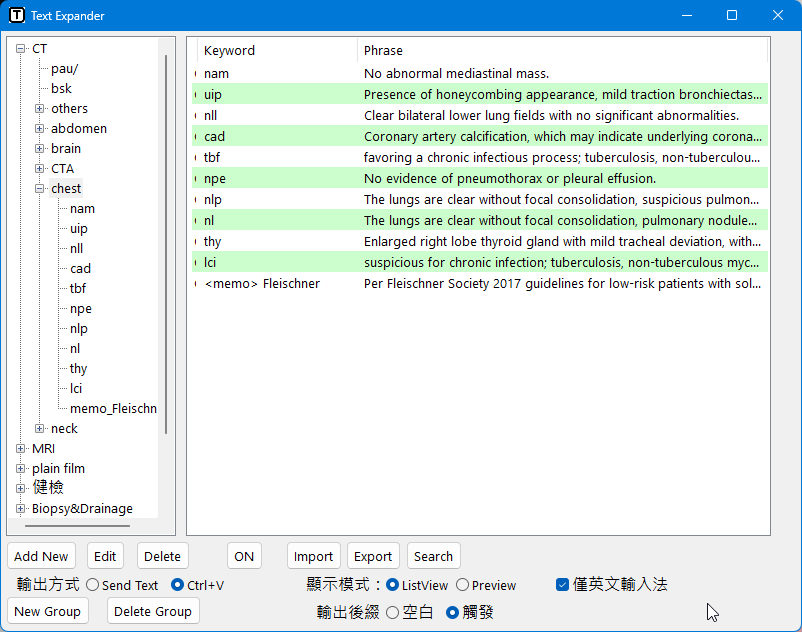

# Text Expander

A text expansion tool developed with AutoHotkey v2, designed for quick input of predefined text snippets.

This project was completed with the assistance of Anthropic's Claude 3.5 Sonnet (2024.04). Claude provided comprehensive programming guidance, code optimization suggestions, and troubleshooting solutions, making significant contributions to the project's development.

## Features

- Group-based text snippet management (with nested sub-groups)
- Dual output modes: direct input and clipboard paste
- Automatic input method switching, with an optional English-IME-only mode
- Dynamic tags: insert `{TODAY}`, `{TIME}` and other date/time tags in snippets
- Built-in search across keywords and snippet content
- Import/Export snippets (merge or replace mode, with automatic backup before import)
- Memo function for notes (without triggering replacement)
- Resizable GUI interface with ListView/Preview display modes
- Triggered by space, period, or comma; output suffix configurable (space or the trigger character)
- Quick toggle via button or hotkey (Ctrl+Alt+S)
- Automatic user preference saving

## Usage

1. Managing Text Snippets:
   - Use the left tree view for group management
   - Use the right list view to view and edit snippets
   - Support add, edit, and delete operations

2. Triggering:
   - Type the keyword followed by space, period, or comma to trigger replacement
   - Example: typing "key" followed by space will replace it with predefined text

3. Output Modes:
   - Send Text: Simulates keyboard input
   - Ctrl+V: Uses clipboard paste (recommended for better performance; the original clipboard content is restored automatically afterwards)

4. Dynamic Tags (write them inside snippet content; replaced at trigger time):

   | Tag | Description |
   |-----|-------------|
   | `{TODAY}` | Today's date (yyyy/MM/dd) |
   | `{TODAY_SHORT}` | Today's date (yy/MM/dd) |
   | `{YESTERDAY}` / `{TOMORROW}` | Yesterday's / tomorrow's date |
   | `{TIME}` / `{TIME_FULL}` | Current time (HH:mm / HH:mm:ss) |
   | `{WEEKDAY}` / `{MONTH}` / `{YEAR}` | Weekday / month / year |

## System Requirements

- Operating System: Windows
- Runtime: AutoHotkey v2.0 or higher
- Library: `LV_Colors.ahk` (bundled in the `Lib` folder; adapted from just me's LV_Colors class)

## File Description

- `text expander.ahk`: Main program file
- `Lib\LV_Colors.ahk`: ListView coloring library
- `snippets.ini`: Text snippet storage file
- `textEx_settings.ini`: User settings file
- `snippets_*.old`: Automatic backups created before import

## Notes

- Ctrl+V mode is recommended for better performance
- Toggle function anytime with Ctrl+Alt+S or GUI button
- Window size is freely adjustable with responsive interface
- Keywords must be unique, must not contain "=", must not start with "["; the `memo_` prefix is reserved for memo items

